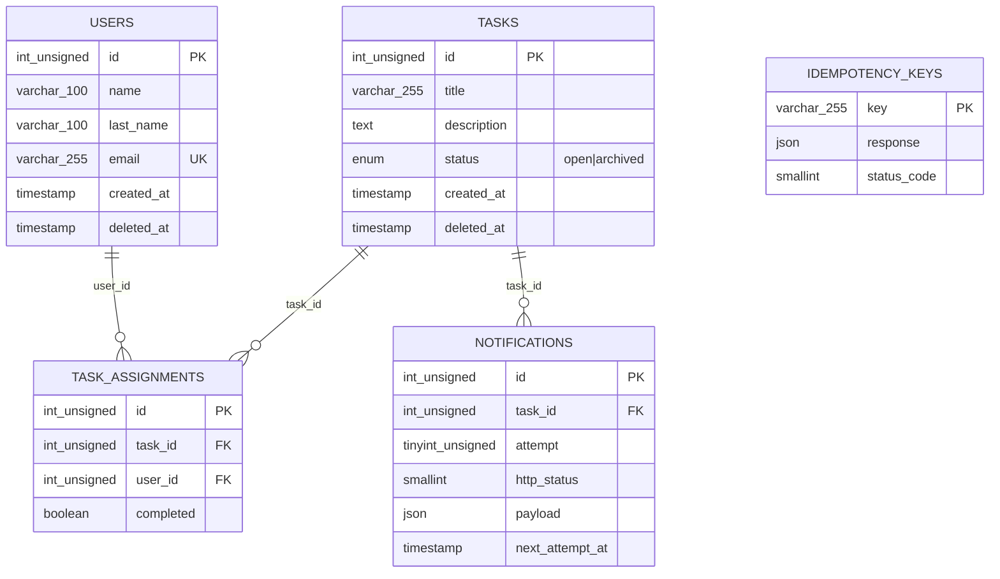

# Revisión técnica — Verificación de las observaciones de Claude

> Revisión realizada sobre el código fuente del repo (sin modificar nada).
> Fecha: 2026-08-23 · Alcance: cumplimiento del reto `RETO GEEST.md` + validez de los bugs reportados por Claude.

---

## Veredicto ejecutivo

| # | Observación de Claude | ¿Confirmada? | Severidad |
|---|------------------------|--------------|-----------|
| a | Falta despliegue público | ✅ Sí (esperable, aún no desplegado) | 🔴 Bloqueante de entregable |
| b | Reintentos de notificación rotos | ✅ Sí, los 3 sub-puntos | 🔴 Bloqueante |
| c | Idempotencia no aguanta concurrencia | ✅ Sí | 🔴 Bloqueante |
| d | Carrera en archivado simultáneo | ✅ Sí | 🔴 Bloqueante |
| m1 | Rutas en `/api/v1` en vez de paths literales | ✅ Sí | 🟡 Importante |
| m2 | Falta párrafo de "la mejora" + dos extras | ✅ Sí | 🟡 Importante |
| m3 | Reintenta también ante 4xx | ✅ Sí | 🟡 Menor |
| **extra 1** | **UML de la BD no existe en ninguna parte** (Claude no lo mencionó) | — | 🔴 Bloqueante de entregable |
| **extra 2** | **README sin sección "funcionalidades recortadas"** (checklist obligatorio) | — | 🟡 Importante |

**Conclusión:** la arquitectura general es buena (rutas/middleware/workers separados, formato de error correcto, FKs y unique constraint en schema), pero la sección **Confiabilidad** —la que más pesa en el reto— tiene 3 bugs reales que deben corregirse antes de desplegar. Además faltan 2 entregables del checklist final que Claude pasó por alto: el **UML** y la sección de **recortes** en el README.

---

## Análisis detallado y correcciones propuestas

### 🔴 B) Reintentos de notificación — CONFIRMADO (roto)

**Evidencia** (`src/workers/notificationWorker.ts`):

1. **La fila deja de ser "pendiente" tras el primer intento.**
   - Éxito: línea 26–29 → `http_status = response.status` (no-nulo).
   - Fallo: líneas 32–38 → el `catch` pone `http_status = error.response?.status || 500` (**también no-nulo**).
   - El selector de la línea 48–50 es `WHERE http_status IS NULL AND attempt < ?`. Tras cualquier primer intento (exitoso o fallido), la fila ya nunca vuelve a calificar → **jamás hay intento 2 ni 3**, aunque `attempt < 3`.
2. **`RETRY_DELAYS = [1000, 3000, 10000]` (línea 6) está declarado y nunca se usa.** El worker corre con `setInterval(..., 2000)` fijo (línea 70). El spec pide "esperas crecientes".
3. **Sin historial por intento.** Al archivar se inserta UNA sola fila (`INSERT INTO notifications ..., 1, ...` en `src/routes/tasks.ts:251`) y cada reintento hace `UPDATE` sobre esa misma fila. `GET /tasks/:idTask/notifications` solo podrá mostrar 1 registro final, cuando el spec exige *"cada intento debe quedar registrado"* con número, timestamp y status HTTP. Nota adicional: la tabla `notifications` no tiene columna `updated_at`/`sent_at`, así que ni siquiera existiría forma de saber *cuándo* ocurrió el reintento con el diseño actual.

#### Corrección propuesta

**Migración nueva** (`migrations/003_notifications_per_attempt.sql`):

```sql
USE geest_task_db;
ALTER TABLE notifications
  ADD COLUMN next_attempt_at TIMESTAMP NULL DEFAULT NULL AFTER payload,
  ADD UNIQUE KEY uq_task_attempt (task_id, attempt);
```

**Reescritura de `src/workers/notificationWorker.ts`:**

```ts
const MAX_ATTEMPTS = 3;
const RETRY_DELAYS = [1000, 3000, 10000]; // índice = attempt - 1

const processNotifications = async (): Promise<void> => {
  const pool = getPool();
  // Solo filas cuyo intento aún no se ha hecho (http_status IS NULL)
  // y cuya espera programada ya venció (next_attempt_at)
  const [pending] = await pool.query(
    `SELECT * FROM notifications
     WHERE http_status IS NULL
       AND attempt <= ?
       AND (next_attempt_at IS NULL OR next_attempt_at <= NOW())`,
    [MAX_ATTEMPTS]
  );

  for (const n of pending as any[]) {
    let httpStatus: number | null = null;
    let retryable = false;

    try {
      const res = await axios.post(process.env.NOTIFY_URL!, n.payload, { timeout: 5000 });
      httpStatus = res.status;
    } catch (error: any) {
      httpStatus = error.response?.status ?? null;
      // SOLO reintentar ante 5xx o falta de respuesta (spec, sección Confiabilidad.3)
      retryable = !error.response || error.response.status >= 500;
    }

    // 1) Registrar ESTE intento (cierra la fila actual)
    await pool.query('UPDATE notifications SET http_status = ? WHERE id = ?', [httpStatus, n.id]);

    // 2) Programar el siguiente intento como FILA NUEVA (historial por intento)
    if (retryable && n.attempt < MAX_ATTEMPTS) {
      const delayMs = RETRY_DELAYS[n.attempt - 1];
      await pool.query(
        `INSERT INTO notifications (task_id, attempt, payload, next_attempt_at)
         VALUES (?, ?, ?, DATE_ADD(NOW(), INTERVAL ? SECOND))`,
        [n.task_id, n.attempt + 1, n.payload, Math.ceil(delayMs / 1000)]
      );
    }
  }
};
```

Esto corrige de una vez los 3 sub-bugs y el punto menor M3 (política de reintento 5xx/no-respuesta únicamente). El `setInterval` de 2 s puede quedarse como poller; los delays reales los impone `next_attempt_at`.

---

### 🔴 C) Idempotencia sin protección real bajo concurrencia — CONFIRMADO

**Evidencia** (`src/middleware/idempotency.ts`):

- Líneas 19–22: `SELECT ... FOR UPDATE` se ejecuta con `pool.query()` **sin transacción explícita**. Con autocommit activo (default de mysql2 pool), el statement ES su propia transacción: el lock se adquiere y libera al terminar ese único statement. **No protege nada entre requests.**
- Líneas 33–44: el `INSERT` de la respuesta ocurre *después*, dentro del override de `res.json`, fire-and-forget (`.catch` que solo loguea). Dos requests paralelos con la misma key pasan ambos el check "no existe" y ejecutan la operación **dos veces** (p. ej. crean dos usuarios).
- El test `tests/idempotency.test.ts` es secuencial (`await res1` antes de `res2`), por eso pasa aunque el mecanismo esté roto — exactamente como dijo Claude.

#### Corrección propuesta — patrón "reservar primero"

En `src/middleware/idempotency.ts`, envolver todo en una transacción real e insertar un **placeholder** antes de ejecutar el handler:

```ts
export const idempotencyMiddleware = async (req, res, next) => {
  const key = req.headers['idempotency-key'] as string;
  if (!key || req.method !== 'POST') return next(); // spec: solo POST

  const connection = await pool.getConnection();
  try {
    await connection.beginTransaction();

    const [existing] = await connection.query(
      'SELECT response, status_code FROM idempotency_keys WHERE `key` = ? FOR UPDATE', [key]
    );
    const rows = existing as any[];

    // Ya completada anteriormente → replay idéntico
    if (rows.length > 0 && rows[0].response !== null) {
      await connection.commit();
      connection.release();
      return res.status(rows[0].status_code).json(rows[0].response);
    }

    // No existe → reservar YA (dentro de la tx). Un request paralelo con la misma
    // key bloqueará aquí en el FOR UPDATE / chocará con la PK hasta que terminemos.
    if (rows.length === 0) {
      await connection.query(
        'INSERT INTO idempotency_keys (`key`, response, status_code) VALUES (?, NULL, 0)', [key]
      );
    }

    await connection.commit(); // la reserva queda visible para todos
    connection.release();
  } catch (e) {
    connection.release();
    logger.error('Idempotency middleware error:', e);
    return next();
  }

  // El handler corre; al responder se hace UPDATE (ya existe la fila)
  const originalJson = res.json.bind(res);
  res.json = function (body: any) {
    getPool().query(
      'UPDATE idempotency_keys SET response = ?, status_code = ? WHERE `key` = ?',
      [JSON.stringify(body), res.statusCode, key]
    ).catch((err) => logger.error('Failed to store idempotent response:', err));
    return originalJson(body);
  };
  next();
};
```

Detalles a decidir durante la implementación:

- Si un segundo request llega mientras el primero sigue procesando (fila con `response IS NULL`), responder `409 Conflict` ("request in progress") o hacer polling corto hasta que aparezca la respuesta. Cualquiera de las dos es defendible; documéntalo en el README.
- La columna `response` debe permitir `NULL` (hoy es `JSON` nullable en `001_initial_schema.sql:55` — ✔ ya lo es, solo ajustar `status_code` NOT NULL → usar 0 como placeholder o hacerlo nullable en la migración 003).
- Opcional (alineado al texto del spec *"misma key **y mismo cuerpo*"*): agregar columna `body_hash` y devolver `422` si la misma key llega con un body distinto, en lugar de repetir la respuesta vieja.
- De paso, limitar el middleware a `POST` (el spec solo exige Idempotency-Key en POST; hoy se aplica a todos los métodos bajo `/api/v1`).

**Test nuevo necesario** (`tests/idempotency.test.ts`): lanzar ambos requests con `Promise.allSettled([...])` y verificar que solo se crea 1 recurso.

---

### 🔴 D) Archivado puede no dispararse con los 2 últimos completando en paralelo — CONFIRMADO

**Evidencia** (`src/routes/tasks.ts:215-258`):

```ts
await connection.beginTransaction();
await connection.query('UPDATE task_assignments SET completed = TRUE ...'); // lectura "current"
const [uncompleted] = await connection.query(
  'SELECT COUNT(*) ... WHERE completed = FALSE'  // ← lectura consistente (snapshot)
);
```

MySQL usa `REPEATABLE READ` por defecto. El `SELECT COUNT(*)` es una lectura **sin lock** que ve el snapshot de la transacción. Escenario del bug (exactamente el del reto):

1. Tx A completa usuario 1; Tx B completa usuario 2, casi al mismo tiempo.
2. A cuenta: no ve el cambio no-commiteado de B → "falta 1" → no archiva.
3. B cuenta: no ve el cambio no-commiteado de A → "falta 1" → no archiva.
4. Ambas commitean. La tarea queda `open` para siempre con 100% completada.

Lo que **sí** está bien: el guard anti-doble-archivado `UPDATE tasks SET status='archived' WHERE id=? AND status='open'` + chequeo de `affectedRows` (líneas 232–238) evita archivar/notificar dos veces *cuando* la serialización ocurre. El problema es que nadie garantiza esa serialización.

#### Corrección propuesta (la que sugiere Claude y es la correcta)

En `src/routes/tasks.ts`, dentro de la transacción del handler `/:idTask/complete`, **bloquear la fila de la tarea antes de contar**:

```ts
const connection = await pool.getConnection();
try {
  await connection.beginTransaction();

  // Serializa las completions de esta tarea: el 2º request espera aquí
  // hasta que el 1º haga commit, y su COUNT posterior ya verá el dato real.
  await connection.query('SELECT id FROM tasks WHERE id = ? FOR UPDATE', [idTask]);

  await connection.query(
    'UPDATE task_assignments SET completed = TRUE WHERE task_id = ? AND user_id = ?',
    [idTask, userId]
  );
  // ... resto igual (COUNT, UPDATE archivado con guard, INSERT notification)
```

Con esto, si A y B llegan en paralelo: A toma el lock, cuenta 1 pendiente, no archiva, commitea. B desbloquea, actualiza su assignment, cuenta **0** pendientes (ya ve el commit de A porque su primera lectura consistente ocurre después), archiva exactamente una vez y encola la notificación exactamente una vez (el guard `WHERE status='open'` queda como segunda defensa).

**Test nuevo necesario** (`tests/tasks.test.ts`): tarea con 2 usuarios asignados, disparar ambos `/complete` con `Promise.allSettled` y verificar: `status === 'archived'` y exactamente 1 evento de notificación inicial.

---

### 🔴 A) Despliegue público ausente — CONFIRMADO (y decisión correcta posponerlo)

- Verificado: no hay `Dockerfile`, `Procfile`, `render.yaml`, `railway.json`, `fly.toml` ni ningún artefacto de deploy en el repo.
- El README no menciona URL pública ni hosting (secciones requeridas: *dónde desplegaste / por qué / cómo acceder*).

Es razonable no haber desplegado aún —pero es el **primer ítem del checklist de entregables** y la evaluación corre contra producción con ventana de 7 días. Cuando el código esté corregido:

1. Agregar `Dockerfile` mínimo (build con `npm ci && npm run build`, arranque con `node dist/app.js`) para que el deploy sea reproducible en cualquier PaaS.
2. Opciones gratuitas/de-centavos coherentes con este stack Node+MySQL: **Render** (free web service + MySQL no free… usar PlanetScope/Aiven free) o **Railway** ($5 crédito, MySQL incluido en un clic — la opción más rápida para este stack). Documentar elección y URL en el README.
3. ⚠️ Recordatorio: los tests (`tests/*.test.ts`) hacen `TRUNCATE TABLE` de todas las tablas en `beforeAll` — **no ejecutar `npm test` contra la BD de producción**.

---

### 🟡 M1) Rutas en `/api/v1/...` en vez de los paths literales del reto — CONFIRMADO

El reto dice textualmente *"simplemente los endpoints exactos definidos"* (`POST /users`, `GET /tasks/:idTask`, etc.). Hoy solo existen bajo `/api/v1` (`src/app.ts:38-39`). Si la evaluación es automatizada contra los paths literales, todo da 404.

**Corrección barata** en `src/app.ts` — montar dual:

```ts
app.use('/api/v1', idempotencyMiddleware);
app.use(idempotencyMiddleware);            // cubrir también los paths raíz

app.use('/api/v1/users', usersRouter);
app.use('/api/v1/tasks', tasksRouter);
app.use('/users', usersRouter);            // ← paths literales del reto
app.use('/tasks', tasksRouter);
```

Actualizar `servers` en `src/config/swagger.ts:15-20` y las tablas del README. Los tests actuales siguen pasando (usan `/api/v1`); agregar 1–2 asserts contra los paths raíz.

---

### 🟡 M2) Falta el párrafo dedicado de "la mejora" — CONFIRMADO

El Extra exige explicar **qué problema resuelve / por qué era necesaria / por qué esta y no otra**, y pide **una sola mejora**. El README solo tiene una línea sobre soft delete en "Decisiones Técnicas" (línea 140) y convive con Swagger como segundo "extra", diluyendo el mensaje.

**Corrección:** añadir sección `## Mejora elegida: Soft Delete` con los 3 puntos pedidos (problema: pérdida de histórico/integridad referencial con DELETE físico dado que `task_assignments` referencia users y tasks; por qué necesaria: auditoría y re-asignación segura; por qué sobre otras: paginación/rate-limit/auth aportan menos valor de producto aquí, y Swagger es tooling de documentación, no funcionalidad de producto — presentarlo como tal, no como "la mejora").

---

### 🟡 M3) Reintentos ante 4xx — CONFIRMADO (subsumido en la corrección B)

`axios` lanza para **cualquier** no-2xx (default `validateStatus`), y el `catch` actual trata 400/404 igual que un 5xx o un timeout. Hoy es irrelevante porque no hay reintentos (bug B), pero al arreglar B hay que aplicar la condición `!error.response || error.response.status >= 500` — ya incluida en el sketch de arriba.

---

## 🔴 Hallazgo adicional 1: falta el UML (Claude no lo señaló)

El checklist final exige: *"Adjuntar un UML con la estructura de la base de datos, incluyendo tipos de datos y relaciones."* Verificado: **no existe ningún diagrama** en el repo (ni mermaid en el README, ni `.png/.svg/.puml/.drawio`).

**Corrección más barata:** bloque Mermaid en el README (GitHub lo renderiza nativamente):



## 🟡 Hallazgo adicional 2: README sin sección de recortes

El checklist pide explicar *"qué funcionalidades se recortaron por falta de tiempo"*. No existe esa sección. Aunque no se haya recortado nada sustancial, hay que escribirla explícitamente (p. ej.: "no se recortó funcionalidad requerida; fuera del alcance quedaron auth/paginación").

---

## Cobertura de tests vs. lo que el reto evalúa

Los tests existentes cubren CRUD básico, validaciones, soft delete y Swagger — todos secuenciales. **Ninguno cubre** los 3 escenarios de Confiabilidad (los que más pesan):

| Test faltante | Qué verifica | Dónde agregarlo |
|---|---|---|
| Auto-archive al completar todos | `POST /complete` x N usuarios → `status='archived'`, 1 notificación | `tests/tasks.test.ts` |
| Completados paralelos (`Promise.allSettled`) | Exactamente 1 archivo + exactamente 1 notificación inicial (fix D) | `tests/tasks.test.ts` |
| Idempotencia paralela (misma key, 2 requests simultáneos) | Solo 1 recurso creado (fix C) | `tests/idempotency.test.ts` |
| Reintentos con axios mockeado (500, 500, 200) | 3 filas en `notifications` con sus http_status (fix B) | `tests/notifications.test.ts` (nuevo) |

---

## Orden de trabajo sugerido

| Prioridad | Tarea | Archivos |
|---|---|---|
| 1 | Fix reintentos + historial por intento (B + M3) | `migrations/003_*`, `src/workers/notificationWorker.ts` |
| 2 | Fix carrera de archivado (D) — 1 línea | `src/routes/tasks.ts:217` |
| 3 | Fix idempotencia concurrente (C) | `src/middleware/idempotency.ts` |
| 4 | Montaje dual de rutas (M1) | `src/app.ts`, `src/config/swagger.ts` |
| 5 | Tests de confiabilidad | `tests/*.test.ts` |
| 6 | UML mermaid + sección "Mejora" + sección "Recortes" + deploy info | `README.md` |
| 7 | Dockerfile + deploy + smoke test en producción | raíz, README |

> Recomendación: correr la suite completa contra una BD local limpia después de 1–3, y solo entonces desplegar. El orden propuesto corrige primero lo que invalidaría la evaluación automática de Confiabilidad.
