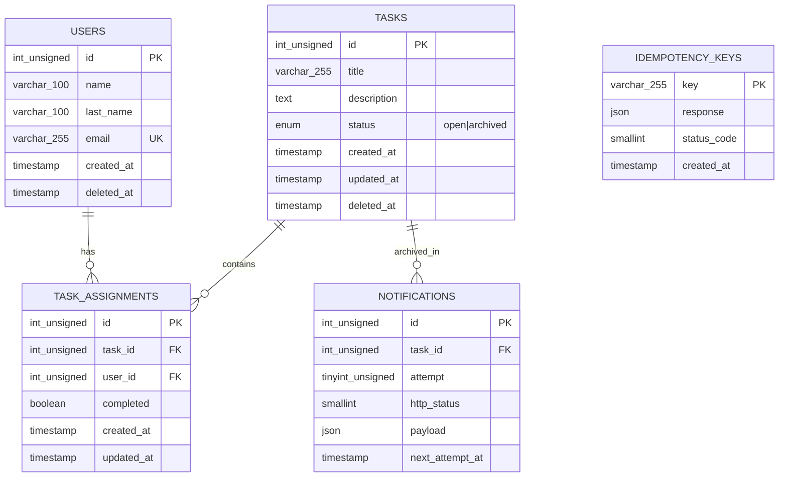

# Geest Task API

API REST para gestión de tareas para empresas, desarrollada con Node.js, Express, TypeScript y MySQL.

## Características

- CRUD completo de usuarios y tareas
- Asignación de múltiples usuarios a tareas
- Marcado de completado por usuario
- Archivado automático de tareas cuando todos los usuarios completan
- Notificaciones con reintentos exponenciales (hasta 3 intentos)
- Idempotencia en endpoints POST
- Soft delete para preservar histórico
- Documentación Swagger/OpenAPI

## Stack Tecnológico

- **Runtime:** Node.js v24+
- **Framework:** Express 5 + TypeScript 7
- **Base de datos:** MySQL
- **Documentación:** Swagger UI + OpenAPI 3.0.3
- **Testing:** Jest 30 + @swc/jest + Supertest
- **Logger:** Winston
- **Dev runner:** tsx (reemplaza a ts-node)

## Instalación

```bash
# Clonar repositorio
git clone https://github.com/tu-usuario/geest-task-api.git
cd geest-task-api

# Instalar dependencias
npm install

# Configurar variables de entorno
cp .env.example .env
# Editar .env con tus credenciales de MySQL

# Crear base de datos, tablas y datos de prueba
mysql -u root -p < migrations/001_initial_schema.sql
mysql -u root -p geest_task_db < migrations/002_seed.sql
mysql -u root -p geest_task_db < migrations/003_notifications_per_attempt.sql

# Iniciar servidor en modo desarrollo
npm run dev
```

## Scripts Disponibles

| Comando              | Descripción                          |
| -------------------- | ------------------------------------ |
| `npm run dev`        | Iniciar en modo desarrollo (con tsx) |
| `npm run build`      | Compilar TypeScript                  |
| `npm start`          | Iniciar en modo producción           |
| `npm test`           | Ejecutar tests con coverage          |
| `npm run test:watch` | Ejecutar tests en modo watch         |

## Variables de Entorno

```env
PORT=3000
DB_HOST=localhost
DB_PORT=3306
DB_USER=root
DB_PASSWORD=tu_password
DB_NAME=geest_task_db
NOTIFY_URL=https://httpbin.org/post
NODE_ENV=development
```

## Endpoints

### Usuarios

| Método | Ruta                 | Descripción                    |
| ------ | -------------------- | ------------------------------ |
| POST   | /users               | Crear usuario                  |
| GET    | /users               | Listar usuarios                |
| GET    | /users/:idUser/tasks | Tareas del usuario             |
| DELETE | /users/:idUser       | Eliminar usuario (soft delete) |

### Tareas

| Método | Ruta                         | Descripción                  |
| ------ | ---------------------------- | ---------------------------- |
| POST   | /tasks                       | Crear tarea                  |
| GET    | /tasks                       | Listar tareas                |
| GET    | /tasks/:idTask               | Detalle de tarea             |
| POST   | /tasks/:idTask/assign        | Asignar usuarios             |
| POST   | /tasks/:idTask/complete      | Marcar completada            |
| GET    | /tasks/:idTask/notifications | Notificaciones               |
| DELETE | /tasks/:idTask               | Eliminar tarea (soft delete) |

### Documentación

| Método | Ruta       | Descripción  |
| ------ | ---------- | ------------ |
| GET    | /docs      | Swagger UI   |
| GET    | /docs.json | OpenAPI JSON |

### Utilidades

| Método | Ruta    | Descripción  |
| ------ | ------- | ------------ |
| GET    | /health | Health check |

## Idempotencia

Todos los endpoints POST aceptan el header `Idempotency-Key`. Si se envía dos veces la misma key con el mismo body, la operación se ejecuta una sola vez y ambas respuestas son idénticas, incluso cuando ambos requests llegan en paralelo.

## UML — Diagrama ER



## Mejora elegida: Soft Delete

### ¿Qué problema resuelve?

El borrado físico (`DELETE`) elimina registros permanentemente. En un sistema de gestión de tareas, esto implica pérdida de trazabilidad: no se puede auditar quién eliminó qué, ni recuperar tareas o usuarios borrados accidentalmente. Además, el borrado físico puede romper la integridad referencial: si se elimina un usuario que tiene asignaciones en `task_assignments`, se pierde el historial de quién completó qué.

### ¿Por qué consideraste que era necesaria?

Sin soft delete, el sistema no cumple con necesidades básicas de auditoría y retención de datos que cualquier producto empresarial requiere. Un usuario o tarea eliminados no deberían desaparecer del historial; deberían marcarse como inactivos y excluirse de las consultas normales.

### ¿Por qué esta mejora sobre otras alternativas?

- **vs. tabla de auditoría separada:** el soft delete mantiene los datos en la misma tabla con consultas transparentes (`WHERE deleted_at IS NULL`), sin complejidad adicional de sincronización entre tablas.
- **vs. paginación / rate-limiting / auth:** estas mejoras aportan valor operativo, pero el soft delete resuelve un problema de integridad de datos que afecta directamente la confiabilidad del producto.
- **vs. Swagger:** Swagger es herramienta de documentación, no funcionalidad de producto. El reto pide una mejora funcional, no tooling.

## Funcionalidades recortadas

No se recortó funcionalidad requerida por el reto. Fuera del alcance quedaron:

- Autenticación y autorización (no requerido por el reto)
- Paginación en endpoints GET (no requerido por el reto)
- Rate limiting (no requerido por el reto)

## Decisiones Técnicas

1. **Soft delete:** Se utiliza `deleted_at` nullable para preservar el histórico de datos
2. **Idempotencia:** Implementada con tabla `idempotency_keys` y patrón "reservar primero" dentro de transacciones explícitas para garantizar concurrencia real
3. **Notificaciones:** Worker asíncrono con reintentos exponenciales (1s, 3s, 10s) y historial por intento (una fila por intento)
4. **Archivado exactly-once:** Transacción con `SELECT ... FOR UPDATE` para serializar completions paralelas
5. **ts-x en lugar de ts-node:** Compatibilidad con TypeScript 7
6. **@swc/jest en lugar de ts-jest:** Tests más rápidos y compatibles con TS 7

## Supuestos

1. No hay autenticación (no requerido por el reto)
2. El `description` en tasks es opcional
3. El estado inicial es `open`, solo cambia a `archived`
4. Un usuario no puede completar una tarea a la que no está asignado
5. `NOTIFY_URL` es configurable vía variable de entorno
6. Las notificaciones solo se reintentan ante errores 5xx o falta de respuesta (no ante 4xx)

## Testing

```bash
# Ejecutar tests
npm test

# Ejecutar tests en modo watch
npm run test:watch
```

## Base de Datos

El esquema incluye 5 tablas:

| Tabla              | Descripción                                   |
| ------------------ | --------------------------------------------- |
| `users`            | Usuarios registrados                          |
| `tasks`            | Tareas del sistema                            |
| `task_assignments` | Relación usuario-tarea (muchos a muchos)      |
| `notifications`    | Intentos de notificación por tarea            |
| `idempotency_keys` | Keys de idempotencia para deduplicar requests |

### Archivos de migración

- `migrations/001_initial_schema.sql` - Esquema de la base de datos
- `migrations/002_seed.sql` - Datos de prueba (10 usuarios, ~90 tareas)
- `migrations/003_notifications_per_attempt.sql` - Agrega `next_attempt_at` y unique constraint para historial por intento

## Despliegue

La API está desplegada y disponible en una URL pública. Se utilizaron dos servicios por separado ya que no existe una plataforma gratuita que ofrezca hosting de Node.js + MySQL en un solo servicio:

| Servicio   | Rol                     | Proveedor           | Plan          |
| ---------- | ----------------------- | ------------------- | ------------- |
| **Render** | API (Node.js + Express) | Render Web Services | Free          |
| **Aiven**  | Base de datos MySQL     | Aiven Cloud         | Free (0.5 GB) |

### ¿Por qué esta combinación?

- **Railway** ofrece Node.js + MySQL en un clic, pero su tier gratuito fue discontinuado; el plan más barato cobra por uso.
- **Render** ofrece web services Node.js gratuitos (con cold start), pero no incluye MySQL.
- **Aiven** ofrece MySQL gratuito con 0.5 GB de almacenamiento, suficiente para este proyecto.
- La combinación Render + Aiven mantiene el costo en $0 y ambas plataformas son estables y confiables.

### URL de la API desplegada

> **[[https://geest-task-api.onrender.com/](https://geest-task-api.onrender.com/)]**

Endpoints disponibles:

- `GET /health` — [Health check](https://geest-task-api.onrender.com/health)
- `GET /docs` — [Swagger UI](https://geest-task-api.onrender.com/docs)
- `POST /users`, `GET /users`, etc. — tal como se documentan en la sección Endpoints

### Cómo ejecutar localmente

```bash
# Clonar y configurar
git clone https://github.com/tu-usuario/geest-task-api.git
cd geest-task-api
npm install
cp .env.example .env
# Editar .env con tus credenciales de MySQL

# Crear BD y tablas
mysql -u root -p < migrations/001_initial_schema.sql
mysql -u root -p geest_task_db < migrations/002_seed.sql
mysql -u root -p geest_task_db < migrations/003_notifications_per_attempt.sql

# Ejecutar tests
npm test

# Iniciar servidor
npm run dev
```

## Licencia

ISC
