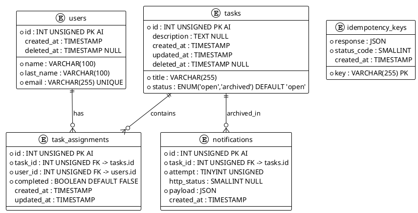

# **UML — Diagrama ER del Reto Geest**

> Mermaid (renderizable en GitHub/GitLab) + PlantUML (opcional para diagramas visuales)

---

## Diagrama ER (Mermaid)

```mermaid
erDiagram
    USERS {
        int id PK AUTO_INCREMENT
        varchar name
        varchar last_name
        varchar email UNIQUE
        timestamp created_at
        timestamp deleted_at NULL
    }

    TASKS {
        int id PK AUTO_INCREMENT
        varchar title
        text description
        enum status "open|archived"
        timestamp created_at
        timestamp updated_at
        timestamp deleted_at NULL
    }

    TASK_ASSIGNMENTS {
        int id PK AUTO_INCREMENT
        int task_id FK
        int user_id FK
        boolean completed
        timestamp created_at
        timestamp updated_at
    }

    NOTIFICATIONS {
        int id PK AUTO_INCREMENT
        int task_id FK
        tinyint attempt
        smallint http_status NULL
        json payload
        timestamp created_at
    }

    IDEMPOTENCY_KEYS {
        varchar key PK
        json response
        smallint status_code
        timestamp created_at
    }

    USERS ||--o{ TASK_ASSIGNMENTS : "has"
    TASKS ||--o{ TASK_ASSIGNMENTS : "contains"
    TASKS ||--o{ NOTIFICATIONS : "archived_in"
```

---

## Diagrama ER (PlantUML — para renderizado con plantuml.jar)



---

## Relaciones resumidas

| Relación | Tipo | Detalle |
|---|---|---|
| `users` → `task_assignments` | 1 a N | Un usuario puede estar asignado a N tareas |
| `tasks` → `task_assignments` | 1 a N | Una tarea puede tener N usuarios asignados |
| `tasks` → `notifications` | 1 a N | Una tarea archivada genera N intentos de notificación |
| `task_assignments.task_id + user_id` | UNIQUE KEY | Evita duplicados en asignación |
| `idempotency_keys.key` | PRIMARY KEY | Deduplicación de requests |

---

## Tipos de datos (MySQL)

| Tabla | Campo | Tipo MySQL | Restricción |
|---|---|---|---|
| `users` | id | INT UNSIGNED | PK AUTO_INCREMENT |
| `users` | name | VARCHAR(100) | NOT NULL |
| `users` | last_name | VARCHAR(100) | NOT NULL |
| `users` | email | VARCHAR(255) | NOT NULL UNIQUE |
| `users` | deleted_at | TIMESTAMP | NULL |
| `tasks` | id | INT UNSIGNED | PK AUTO_INCREMENT |
| `tasks` | title | VARCHAR(255) | NOT NULL |
| `tasks` | description | TEXT | NULL |
| `tasks` | status | ENUM('open','archived') | DEFAULT 'open' |
| `task_assignments` | completed | BOOLEAN | DEFAULT FALSE |
| `notifications` | http_status | SMALLINT | NULL (si no hubo respuesta) |
| `idempotency_keys` | key | VARCHAR(255) | PK (header idempotency-key) |
